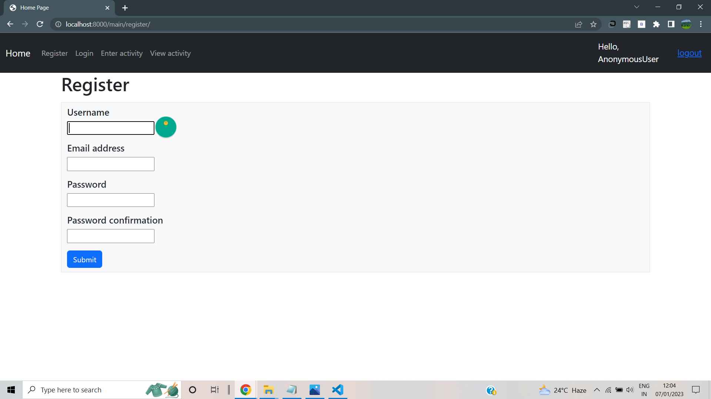

# Master
This is a master-student web app made using Django and bootstrap.
This app has signup, login and logout options.

Master can add activities(calculations).
Students can only view the activity logs and cannot edit activity.
