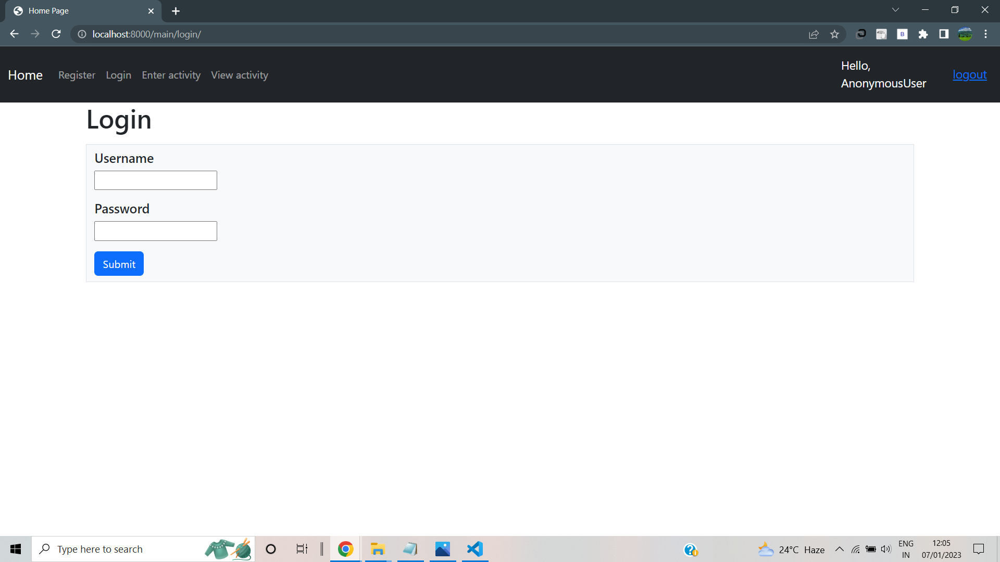
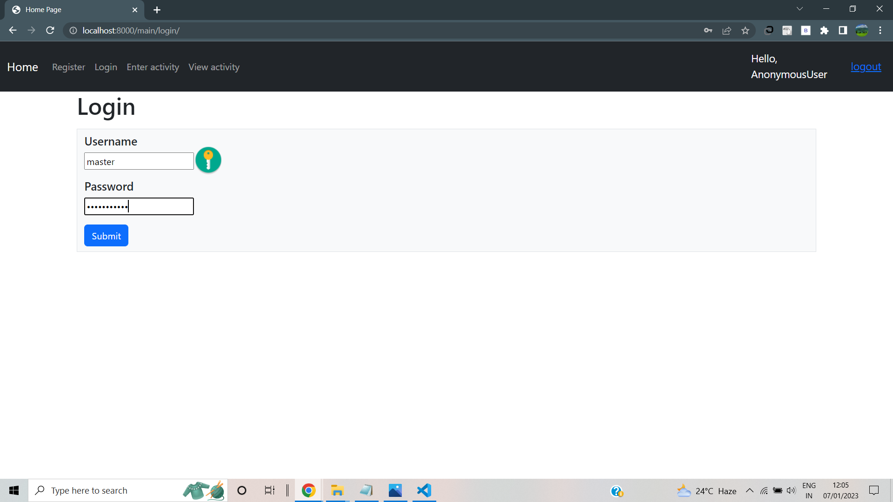
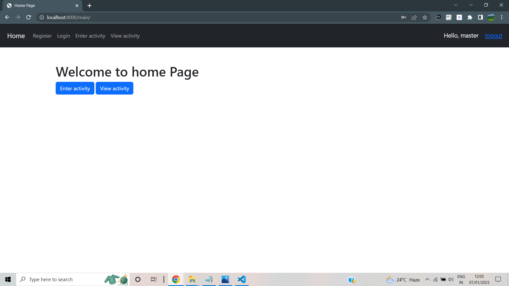
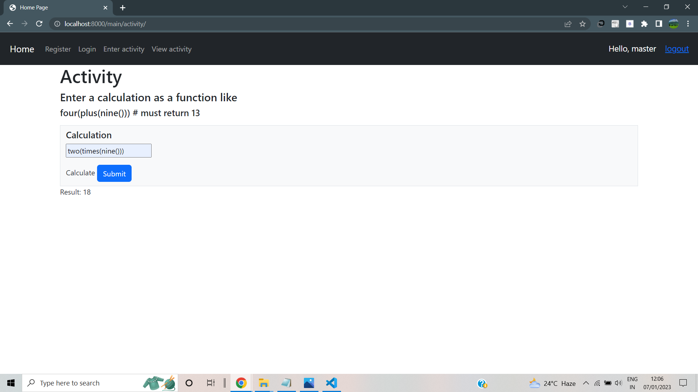
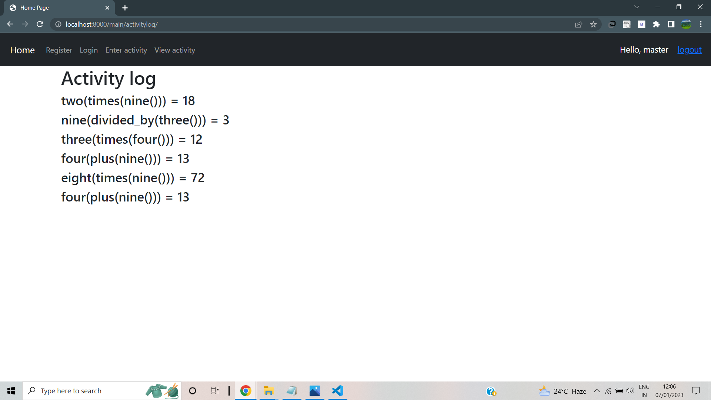
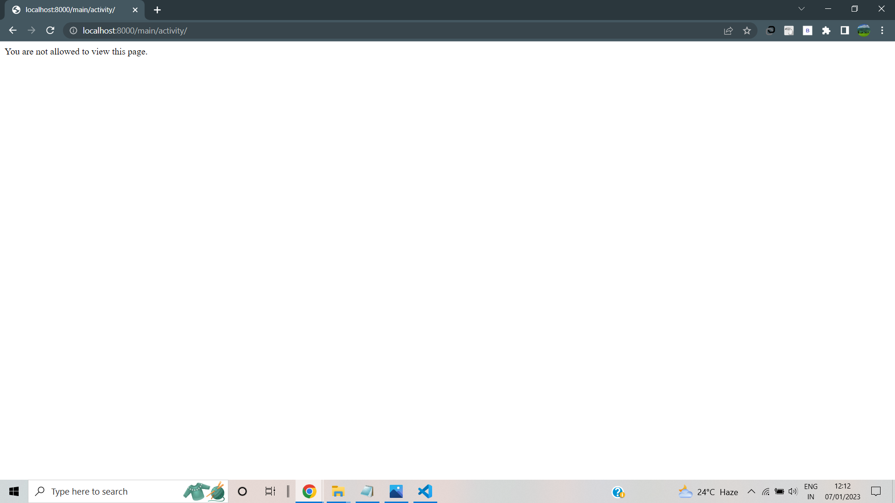

# Master

<h4>This is a master-student web app made using Django and bootstrap.</h4>

<h4>This app has signup, login and logout options.</h4>

<h4>Master can add activities(calculations).</h4>

<h4>Students can only view the activity logs and cannot edit activity.</h4>

